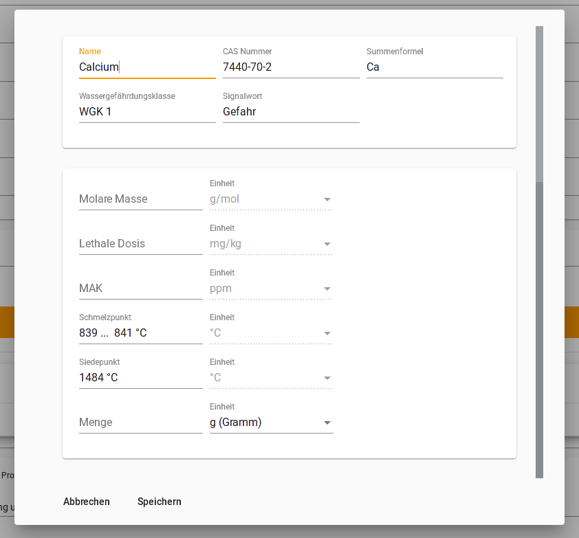

# Calciumdibromid - Getting Started

CaBr2 ist ein Open-Source Programm (siehe [Lizenz](https://github.com/Calciumdibromid/CaBr2/blob/master/LICENSE)) zur Erstellung von Betriebsanweisungen für Laboreinheiten nach EG Nr. 1272/2008.

---

Die Daten zum Befüllen der Betriebsanweisung beziehen sich auf mehrere Quellen, die individuell in den Einstellungen ausgewählt werden können:

- [Gestis-Stoffdatenbank](https://gestis.dguv.de/search)

    (Die Quellen werden in den folgenden Versionen erweitert)

---

## Anleitung zur Suche

CaBr2 ermöglicht es, auf mehreren Weisen nach Stoffdaten für die verwendeten Stoffen zu suchen.

### **Suche**

Die Suche kann mit verschiedenen Filtern eingegrenzt oder definiert werden.

Falls beispielsweise explizit nur nach der Summenformel gesucht werden soll, kann in der "Suchen"- Spalte statt Stoffname Summenformel ausgewählt werden.
Mit Hilfe des Pluses darunter können zudem weitere Filter ausgewählt werden. Mehrere Filter können zusammen verwendet werden.

> Wichtige Information zur Summenformel !!!
> - Gestis akzeptiert nur eine bestimmte Summenformel
>
>   --> B(OH)3 wird zum Beispiel nur als H3BO3 akzeptiert
>
>   --> CH3COOH wird nur als C2H4O2 akzeptiert

### **Exakte Suche**

Wenn mit einem Filter nach einer Chemikalie gesucht wird, die in vielen Verbindungen vorkommt, kann mit Hilfe der exakten Suche direkt nach der Grundchemikalie gesucht werden.

 

---

## Information zur Bearbeitung

Die ausgewählten Chemikalien werden unter der Suche aufgelistet.

Um diese im Nachhinein bearbeiten zu können, kann mit der Maus die gewünschte Chemikalie ausgewählt und angeklickt werden.

### **Mengenangabe hinzufügen**

Auf der Betriebsanweisung gibt es die Spalte _Für Ansatz benötigt_.
Im Fenster, welches sich nach Anklicken der zu bearbeitenden Chemikalie öffnet, kann diese individuell ausgefüllt werden.

<!--neues Bild mit Molarer Masse usw. dabei?-->

---

## Betriebsanweisung speichern/exportieren

Unter Menü kann die erstellte Betriebsanweisung als pdf-Datei exportiert oder als cb2-Datei gespeichert werden.

cb2-Dateien können in CaBr2 erneut geöffnet und verändert werden.

---

## Weitere Informationen
Genauere Informationen und Erklärungen zu CaBr2 sind auf GitHub oder unter www.cabr2.de zu finden.

Dort sind unter dem Abschnitt [Anleitung](https://cabr2.de/anleitung.html) exakte Erklärungen zu jedem Thema aufgeführt.
