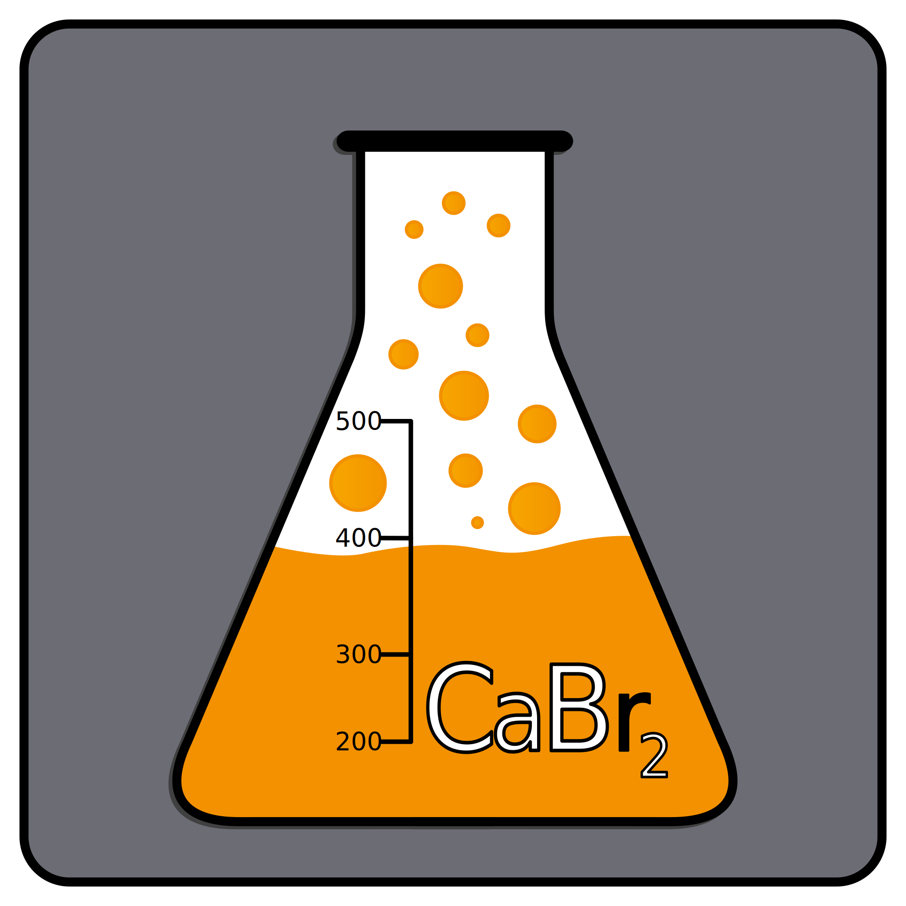
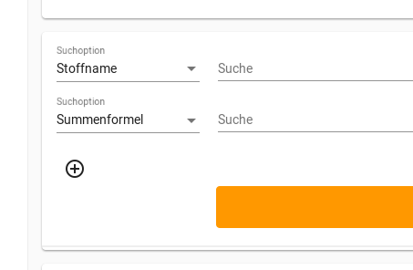
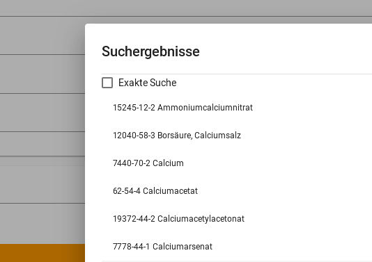
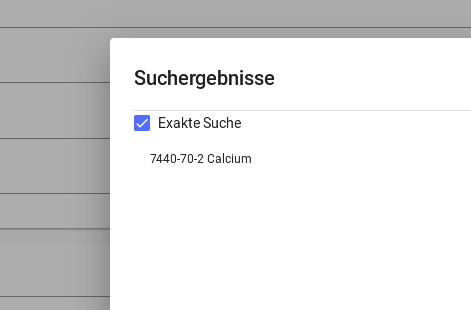

# Calciumdibromid - CaBr<sub>2</sub>

  <!--Icon-->

CaBr<sub>2</sub> ist ein Programm zur Erstellung von Betriebsanweisungen für Laboreinheiten nach EG Nr. 1272/2008.

Die Daten zum Befüllen der Betriebsanweisung beziehen sich auf mehrere Quellen, die individuell in den Einstellungen ausgewählt werden können: <!--??????-->

- [Gestis-Stoffdatenbank](https://gestis.dguv.de/search)

    (Die Quellen werden in den folgenden Versionen erweitert)

Bei CaBr<sub>2</sub> handelt es sich um ein Open-Source-Projekt (siehe [Lizenz](https://github.com/Calciumdibromid/CaBr2/blob/master/LICENSE)) und daher basiert die Verwendung der generierten Betriebsanweisungen auf Eigenverantwortung.
> TODO umformulieren

<!--Es wurde von Studenten der Technischen Hochschule Rosenheim für Chemieingenieurstudenten des Campus Burghausen entwickelt.-->

---

## Anleitung zur Suche

CaBr<sub>2</sub> ermöglicht es, auf mehreren Weisen nach Stoffdaten für die verwendeten Stoffen zu suchen.

### Suche

Die Suche kann mit verschiedenen Filtern eingegrenzt oder definiert werden.

Falls beispielsweise explizit nur nach der Summenformel gesucht werden soll, kann in der "Suchen"- Spalte statt Stoffname Summenformel ausgewählt werden.
Mit Hilfe des Pluses darunter können zudem weitere Filter ausgewählt werden. Mehrere Filter können zusammen verwendet werden.



### Exakte Suche

Wenn mit einem Filter nach einer Chemikalie gesucht wird, die in vielen Verbindungen vorkommt, kann mit Hilfe der exakten Suche direkt nach der Grundchemikalie gesucht werden.

 

---

## Information zur Bearbeitung

Die ausgewählten Chemikalien werden unter der Suche aufgelistet.

Um diese im Nachhinein bearbeiten zu können, kann mit der Maus die gewünschte Chemikalie ausgewählt und angeklickt werden.

### Mengenangabe hinzufügen

Auf der Betriebsanweisung gibt es die Spalte **Für Ansatz benötigt**.  
Im Fenster, welches sich nach Anklicken der zu bearbeitenden Chemikalie öffnet, kann diese individuell ausgefüllt werden.

(Bild)

---

## Telemetrie Meldung

**Da CaBr<sub>2</sub> sich noch in der Entwicklungsphase befindet, kann es noch zu unvollständigen oder fehlerhaften Suchergebnissen kommen.**

Um die Suche verlässlicher und genauer gestalten zu können, müssen die Stoffe analysiert werden, bei denen Probleme bei der Suche aufgetreten sind.

Um dies machbar zu machen, würden wir gerne im Hintergrund diese Stoffe zu uns senden, damit das Programm so gut wie möglich verbessert und für euch möglichst viel automatisiert werden kann.

Die Daten, die wir bekommen, werden in diesem Format gesendet:

```json
{
    "gestisId": "000815",  // ID des Stoffes in der Gestis Datenbank
    "parts": [
        "lethalDose",
        "hPhrases"
    ]
}
```

> Disclaimer: Es wird bei der Übermittlung auch die eigene IP-Adresse übermittelt, aber diese wird nicht gespeichert. Ohne die IP-Adresse ist eine Übermittlung nicht möglich.
> Der Quellcode des Servers ist hier zu finden: <https://to.do>.

<!--
TODOs
- x exakte suche erklären
- x filter hinzufügen
- x wie stoffbearbeiten funktioniert
- was man alles verändern kann
- Summenformel???? 
- 
-
- x daten sammeln erklären 
- Einverständniserklärung
-->
